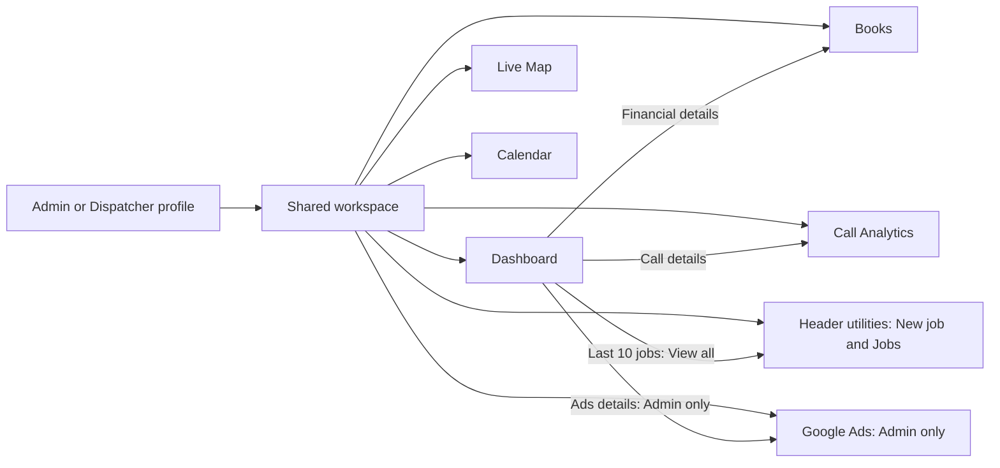

# Admin and Dispatcher workspace redesign

Prepared October 7, 2026 · Product, technology, and business implementation plan

**Recommendation:** Give Admin and Dispatcher the same operational workspace and menu order. Keep them as separate account profiles, with Admin capabilities added through explicit permissions. Make Dashboard a summary with useful destinations, give each detailed workflow a clear home, and separate trustworthy business reporting from advertising attribution.

This is a plan, not an application change. Discovery covered the current workspace source and documentation. Production data, deployed screens, migration state, and the connected Google Ads account were not inspected. Estimates and success targets below are planning assumptions, not measured baselines.

## Phase 0 — Documentation discovery and evidence

### Current state

| Finding | Evidence | Consequence for this plan |
|---|---|---|
| Admin and Dispatcher already exist as distinct stored roles. Admin can also enter a narrower Dispatcher session mode. | D01–D03 | Preserve account identities. Remove routine mode switching from primary navigation; Admin can dispatch using the Admin profile. |
| Navigation mixes Dispatch desk, Calendar, Live map, Call Analytics, Admin hub, Books, and Technician view. Both operational profiles land at Dispatch. | D01, D04 | Introduce one canonical Dashboard and one ordered menu definition. |
| Owner and Dispatch calculate overlapping financial summaries separately. The owner response also contains Ads data and the technician ledger. | D05–D07 | Share the financial calculation service, but keep shared and Admin-only response contracts separate. |
| The owner dashboard already returns the latest 10 jobs, but loads all jobs first. Its accounting CSV also uses those same 10 rows. | D05, D06 | Retain the ten-job preview; give complete filtered exports their own endpoint and destination. |
| Books is a 2,664-line page showing entity details, reimbursements, mapping forms, expenses, periods, invoices, and history together. | D09 | Split by task and load only the active subsection. Reuse the existing accounting workflows. |
| Dispatcher Books access is restricted to Locksmith. Admin sees both entities. Accountant access is membership-based. Several financial actions are already Admin-only. | D10 | A shared appearance does not mean identical financial permissions. Preserve these boundaries. |
| Call Analytics already exists as a separate shared page. Its “Converted” metric counts every job logged in the period, whether linked to a call or not. | D12–D13 | Improve this page and its definitions. Do not label that ratio confirmed call conversion. |
| Ads cache contains daily account spend, clicks, impressions, and conversion value, but no conversion count or campaign dimensions. Current “ROI” uses all business contribution; “ROAS” uses contribution/spend. | D14–D16 | Launch honest account-level reporting first. Campaign performance and attributed job return require additional data. |
| Live Map currently displays historical customer locations, geocoded in the browser. It has no technician position feed or background refresh. | D17 | First deliver an up-to-date active-job map. Treat technician GPS as a separate feature. |
| Calendar mixes appointments, completed work, revenue, and Admin partner return after Ads. | D18 | Make scheduling the default task; move advertising analysis to Google Ads. |

### Source catalog and copy-ready patterns

These sources must be read at the start of the implementation phase that uses them. Line references identify the inspected baseline and may move after edits.

| ID | Documentation or source | Verified pattern to reuse |
|---|---|---|
| D01 | [NavigationHeader.tsx:65](/Users/ankitmalhotra/Development/Locksmith_Operations/src/components/NavigationHeader.tsx:65), [menu construction:89](/Users/ankitmalhotra/Development/Locksmith_Operations/src/components/NavigationHeader.tsx:89), [responsive shell:106](/Users/ankitmalhotra/Development/Locksmith_Operations/src/components/NavigationHeader.tsx:106) | Existing links, active states, mobile drawer, collapsed sidebar, role labels, and role-switch entry points. |
| D02 | [session.ts:1](/Users/ankitmalhotra/Development/Locksmith_Operations/src/lib/session.ts:1), [auth.ts:10](/Users/ankitmalhotra/Development/Locksmith_Operations/src/lib/auth.ts:10), [role-mode route:7](/Users/ankitmalhotra/Development/Locksmith_Operations/src/app/api/auth/role-mode/route.ts:7) | `AppRole`, `AuthSession`, `getCurrentUser(): Promise<AuthSession \| null>`, and `setSessionCookie(user: AuthSession)`. Database-backed active-account validation and effective-role downgrade. |
| D03 | [middleware.ts:14](/Users/ankitmalhotra/Development/Locksmith_Operations/src/middleware.ts:14), [matcher:88](/Users/ankitmalhotra/Development/Locksmith_Operations/src/middleware.ts:88) | Coarse role gates and route matcher registration. `/api/owner/*` remains Admin-only. |
| D04 | [login page:20](/Users/ankitmalhotra/Development/Locksmith_Operations/src/app/login/page.tsx:20), [login API:111](/Users/ankitmalhotra/Development/Locksmith_Operations/src/app/api/auth/login/route.ts:111), [layout:60](/Users/ankitmalhotra/Development/Locksmith_Operations/src/app/layout.tsx:60), [shell CSS:27](/Users/ankitmalhotra/Development/Locksmith_Operations/src/app/globals.css:27) | Role landing destinations, safe local redirect convention, and single global navigation placement. |
| D05 | [owner analytics:22](/Users/ankitmalhotra/Development/Locksmith_Operations/src/app/api/owner/analytics/route.ts:22), [recentJobs:312](/Users/ankitmalhotra/Development/Locksmith_Operations/src/app/api/owner/analytics/route.ts:312) | Paid-invoice financial calculations, seven-day series, separate Admin payload, and latest-ten preview. |
| D06 | [owner page:206](/Users/ankitmalhotra/Development/Locksmith_Operations/src/app/owner/page.tsx:206), [CSV:380](/Users/ankitmalhotra/Development/Locksmith_Operations/src/app/owner/page.tsx:380), [widgets:541](/Users/ankitmalhotra/Development/Locksmith_Operations/src/app/owner/page.tsx:541) | Existing UI patterns; load-time Ads sync and ten-row CSV coupling must be removed from the new Dashboard. |
| D07 | [dispatch page:883](/Users/ankitmalhotra/Development/Locksmith_Operations/src/app/dispatch/page.tsx:883), [intake:413](/Users/ankitmalhotra/Development/Locksmith_Operations/src/app/dispatch/page.tsx:413), [job desk:1637](/Users/ankitmalhotra/Development/Locksmith_Operations/src/app/dispatch/page.tsx:1637), [job API:20](/Users/ankitmalhotra/Development/Locksmith_Operations/src/app/api/jobs/route.ts:20) | Existing job creation, assignment, manual entry, table/board, and detail/receipt actions. |
| D08 | [period-comparison API:28](/Users/ankitmalhotra/Development/Locksmith_Operations/src/app/api/analytics/period-comparison/route.ts:28), [revenue-period.ts:25](/Users/ankitmalhotra/Development/Locksmith_Operations/src/lib/revenue-period.ts:25), [period-comparison.ts:5](/Users/ankitmalhotra/Development/Locksmith_Operations/src/lib/period-comparison.ts:5), [widget:26](/Users/ankitmalhotra/Development/Locksmith_Operations/src/components/PeriodComparisonWidget.tsx:26) | Narrow shared aggregate API; `getRevenuePeriodBounds`, `getRevenueActivityDate`, `isInRevenuePeriod`; equal-elapsed-day comparisons. |
| D09 | [Books loading:483](/Users/ankitmalhotra/Development/Locksmith_Operations/src/app/books/page.tsx:483), [page sections:1100](/Users/ankitmalhotra/Development/Locksmith_Operations/src/app/books/page.tsx:1100), [repayment flow:879](/Users/ankitmalhotra/Development/Locksmith_Operations/src/app/books/page.tsx:879), [invoice detail:1073](/Users/ankitmalhotra/Development/Locksmith_Operations/src/app/books/page.tsx:1073) | Existing forms, receipt review, payee grouping, repayment preview, and lazy document detail. |
| D10 | [accounting-auth.ts:124](/Users/ankitmalhotra/Development/Locksmith_Operations/src/lib/accounting-auth.ts:124), [capability check:180](/Users/ankitmalhotra/Development/Locksmith_Operations/src/lib/accounting-auth.ts:180), [Books access API:8](/Users/ankitmalhotra/Development/Locksmith_Operations/src/app/api/books/access/route.ts:8) | `getAccountingEntityAccess(entityCode, user?)`, `requireAccountingEntityAccess(entityCode, permission?, user?)`, entity-scoped capabilities. |
| D11 | [expenses API:98](/Users/ankitmalhotra/Development/Locksmith_Operations/src/app/api/books/expenses/route.ts:98), [reimbursements API:32](/Users/ankitmalhotra/Development/Locksmith_Operations/src/app/api/books/reimbursements/route.ts:32), [allocation transaction:131](/Users/ankitmalhotra/Development/Locksmith_Operations/src/app/api/books/reimbursements/route.ts:131), [export:14](/Users/ankitmalhotra/Development/Locksmith_Operations/src/app/api/books/reimbursements/export/route.ts:14), [cents helpers:19](/Users/ankitmalhotra/Development/Locksmith_Operations/src/lib/books-api.ts:19) | Existing expense date filters, integer-cent validation, serializable repayment transaction, authenticated evidence, and entity-scoped CSV. |
| D12 | [Call Analytics page:6](/Users/ankitmalhotra/Development/Locksmith_Operations/src/app/dispatch/call-analytics/page.tsx:6), [component:134](/Users/ankitmalhotra/Development/Locksmith_Operations/src/components/RingCentralCallAnalytics.tsx:134), [shared API:8](/Users/ankitmalhotra/Development/Locksmith_Operations/src/app/api/ringcentral/call-analytics/route.ts:8) | Shared role gate, cache-only reads, provider refresh, existing call detail fields. |
| D13 | [call analytics:164](/Users/ankitmalhotra/Development/Locksmith_Operations/src/lib/ringcentral-analytics.ts:164), [legacy ratio:249](/Users/ankitmalhotra/Development/Locksmith_Operations/src/lib/ringcentral-analytics.ts:249), [demand heatmap:95](/Users/ankitmalhotra/Development/Locksmith_Operations/src/lib/ringcentral-demand.ts:95), [job timing:183](/Users/ankitmalhotra/Development/Locksmith_Operations/src/lib/ringcentral-demand.ts:183) | `buildRingCentralCachedAnalytics`, cached classification/callback rules, coverage-aware four-week patterns, and approximate manual-job timing. |
| D14 | [google-ads.ts:193](/Users/ankitmalhotra/Development/Locksmith_Operations/src/lib/google-ads.ts:193), [daily query:255](/Users/ankitmalhotra/Development/Locksmith_Operations/src/lib/google-ads.ts:255), [Ads schema:417](/Users/ankitmalhotra/Development/Locksmith_Operations/prisma/schema.prisma:417) | Existing OAuth-backed REST/GAQL fetch, micro-to-currency conversion, and account/date cache. Existing ROI helper is a business-spend comparison. |
| D15 | [Ads sync:17](/Users/ankitmalhotra/Development/Locksmith_Operations/src/app/api/owner/google-ads/sync/route.ts:17), [connect:10](/Users/ankitmalhotra/Development/Locksmith_Operations/src/app/api/owner/google-ads/connect/route.ts:10), [callback:28](/Users/ankitmalhotra/Development/Locksmith_Operations/src/app/api/owner/google-ads/callback/route.ts:28), [Admin private response:20](/Users/ankitmalhotra/Development/Locksmith_Operations/src/app/api/owner/ai-insights/route.ts:20) | Admin server checks, account-scoped upserts, encrypted credentials, OAuth state, private/no-store response pattern. |
| D16 | [Ads aggregation:225](/Users/ankitmalhotra/Development/Locksmith_Operations/src/app/api/owner/analytics/route.ts:225), [Ads widget:743](/Users/ankitmalhotra/Development/Locksmith_Operations/src/app/owner/page.tsx:743) | Current company/partner conventions, freshness/partial coverage, reconnect handling. |
| D17 | [map page:76](/Users/ankitmalhotra/Development/Locksmith_Operations/src/app/dispatch/map/page.tsx:76), [job schema:211](/Users/ankitmalhotra/Development/Locksmith_Operations/prisma/schema.prisma:211), [address selection:14](/Users/ankitmalhotra/Development/Locksmith_Operations/src/components/AddressAutocomplete.tsx:14) | Existing Mapbox view, job addresses, status data, manual refresh. Address autocomplete returns a string and currently discards coordinates. No live technician-location feed. |
| D18 | [calendar page:36](/Users/ankitmalhotra/Development/Locksmith_Operations/src/app/dispatch/calendar/page.tsx:36), [calendar activity:33](/Users/ankitmalhotra/Development/Locksmith_Operations/src/lib/calendar-activity.ts:33), [calendar Ads API:24](/Users/ankitmalhotra/Development/Locksmith_Operations/src/app/api/owner/calendar-ad-spend/route.ts:24) | Toronto date grouping, appointments/unscheduled queue, job links. Ads read needs customer-account scoping if retained. |
| D19 | [team API:35](/Users/ankitmalhotra/Development/Locksmith_Operations/src/app/api/auth/users/route.ts:35), [settlement API:7](/Users/ankitmalhotra/Development/Locksmith_Operations/src/app/api/owner/settle/route.ts:7), [job-workflow.ts:1](/Users/ankitmalhotra/Development/Locksmith_Operations/src/lib/job-workflow.ts:1) | Existing technician versus all-staff permissions, Admin-only cash settlement, authoritative job transitions. |
| D20 | [job-helper.ts:87](/Users/ankitmalhotra/Development/Locksmith_Operations/src/lib/job-helper.ts:87), [accounting.ts:52](/Users/ankitmalhotra/Development/Locksmith_Operations/src/lib/accounting.ts:52), [Books separation:575](/Users/ankitmalhotra/Development/Locksmith_Operations/prisma/schema.prisma:575), [billing snapshots:41](/Users/ankitmalhotra/Development/Locksmith_Operations/src/app/api/books/periods/route.ts:41) | Compatibility reads, existing partner formula, domain separation, immutable issued billing snapshots. |

### Allowed APIs and documentation constraints

- Existing shared API patterns: `GET /api/analytics/period-comparison`, `GET /api/ringcentral/call-analytics?range=today|yesterday|last-week`, and `POST /api/ringcentral/call-analytics/refresh`. New date/subsection parameters must be implemented and validated before navigation uses them.
- Existing job list accepts `status` and `technicianId`; it has no date/search/pagination contract. `findJobsWithDetails(args)` currently accepts `where` and `orderBy`, not `take`, `select`, or a cursor. Add a purpose-specific query or explicitly extend the helper; do not pass undocumented arguments.
- Existing Books APIs cover expenses, receipt drafts, periods, invoices, repayments, reversals, mapping, and reimbursement CSV. Expense listing already accepts `entityCode`, `from`, `to`, and `includeVoided`. Pagination and other filters below are proposed additions.
- Reuse Toronto helpers and the fixed partner-period anchor. Reuse manual invoice normalization before changing query aggregation; a raw database sum may not reproduce current normalized results.
- Google documents GAQL reporting through `GoogleAdsService.Search` and `SearchStream`. Reuse the existing REST integration rather than assuming an SDK dependency. See [Google reporting overview](https://developers.google.com/google-ads/api/docs/reporting/overview).
- Every granular Ads query must be checked against the configured API version/resource and compatible fields. Segments can change scope and multiply row counts; keep separate query grains. See [Google segmentation guidance](https://developers.google.com/google-ads/api/docs/reporting/segmentation).
- Missing segmented rows can represent zero activity after a successful query, but do not prove that a sync succeeded. Record coverage separately. See [Google zero-metric reporting](https://developers.google.com/google-ads/api/docs/reporting/zero-metrics).
- Existing plans are context, not proof of remaining work. The reimbursement feature and separate Call Analytics page are already substantially implemented. This plan supersedes older navigation recommendations while preserving their established accounting and date rules.

**Discovery verification:** Recheck source references before edits; record production migration/readiness and a role-by-role baseline in staging before rollout. No production write is part of discovery.

**Discovery guards:** Do not invent campaign attribution, technician coordinates, new library APIs, or unimplemented route parameters. Do not interpret a stale implementation plan as authority to rebuild features that already exist.

## Executive decisions — CPO, CTO, CEO

| Perspective | Decision | Business or user outcome |
|---|---|---|
| CPO | One shared shell, the requested six-menu order, consistent titles, one clear next action per summary. | Staff know where to look and where to act. |
| CPO | Books is organized around the task: review, record expense, repay a person, manage billing, report. | Routine work no longer requires scrolling through unrelated forms. |
| CTO | A central permission policy drives visibility; servers still authorize every route and entity. | Shared UI cannot accidentally grant Dispatcher access to Ads or private books. |
| CTO | Shared metric definitions and separate summary/detail APIs replace duplicated browser calculations. | Dashboard and detail reports reconcile and stay responsive as data grows. |
| CEO | Release the workspace cleanup before advanced attribution. Prioritize faster intake, fewer unresolved callbacks, clearer money balances, and useful ad-spend decisions. | Deliver operational value before investing in complex data collection. |
| CEO | Measure task completion and financial agreement, then expand Ads reporting through evidence gates. | Avoid shipping attractive charts that lead to incorrect spending decisions. |

## Product contract

### Two profiles, one workspace

Admin and Dispatcher remain separate user accounts and persisted roles. Both use the same layout and core workflows. Their name and profile appear in the account area. Logging in does not require choosing a view or switching roles.

Admin capabilities are additions to this workspace. Remove “Admin hub” as a separate primary destination and remove the routine “Switch to Dispatcher” button. If support still needs a preview, put **Preview Dispatcher experience** under Admin settings, retain the real restricted session behavior, and display an obvious return control. Existing downgraded sessions must continue to have a safe return to Admin; never grant Ads access based on `originalRole`.

### Primary navigation and route destinations

The order below is fixed for desktop, collapsed sidebar, and mobile drawer.

| Order | Menu | Admin | Dispatcher | Canonical destination |
|---|---|---|---|---|
| 1 | Dashboard | Yes, with Admin widgets | Yes | `/dashboard` — new |
| 2 | Call Analytics | Yes | Yes | `/dispatch/call-analytics` — existing |
| 3 | Books | Authorized entities and actions | Locksmith entity and permitted actions | `/books` — existing, becomes overview |
| 4 | Live Map | Yes | Yes | `/dispatch/map` — existing |
| 5 | Calendar | Yes | Yes | `/dispatch/calendar` — existing |
| 6 | Google Ads | Yes | Hidden and server-denied | `/google-ads` — new |

Keep **New job** as a persistent primary action and **Jobs** as a persistent header utility linking to `/dispatch`, the full operations desk. On mobile, provide the same actions without hiding them inside an account menu. Dashboard’s “View all jobs” also leads there. The ten-row Dashboard limit never applies to the Jobs desk.

The New job action opens a clear **Assigned / Unassigned / Completed entry** choice, preserving existing forms and optional cached call selection. Define a new explicit intake query parameter during implementation; the current `/dispatch?addJob=1` opens completed/manual entry and must retain that behavior for old links.

Keep staff administration and cash settlement reachable through the secondary Admin tools entry at `/owner` during Phase 1. Move those controls to their replacement Admin destinations in Phase 2, but keep `/owner` working as the legacy Admin analytics and Ads hub until the Ads replacement is ready. Redirect `/owner` only after Phase 6 replaces its Ads analytics and Phase 7 verifies that the Admin team and cash-ledger destinations remain reachable with their existing permissions. Preserve query parameters and send recognized `googleAdsAuth=connected|failed` results to `/google-ads`. Keep Technician management reachable from Jobs for both operational roles. Admin’s Technician view becomes an account utility. Accountant retains a Books-only workspace, and Technician retains My jobs.

Both Admin and Dispatcher default to `/dashboard` on login, while valid authorized deep links remain respected. The logo links to the appropriate role home. Keep `/owner` fully functional as the legacy Admin analytics, Ads, team-management, and cash-settlement location through Phase 1 and until its replacements pass their gates. Make its compatibility redirect only after Phase 6 Ads replacement and Phase 7 role verification, once Admin team and cash-settlement controls are reachable in their replacement destinations; preserve query state and route recognized `googleAdsAuth` results to `/google-ads`. Keep owner APIs restricted. Do not redirect `/dispatch` away from the operational desk.

### Permission matrix to preserve

Google Ads is the most visible profile difference, but the repository already has additional sensitive-action boundaries. Preserve them during this redesign; any expansion is a separate product decision.

| Capability | Admin | Dispatcher |
|---|---|---|
| Dashboard operational and shared financial summaries | Yes | Yes |
| Call analytics, cached refresh, callback investigation | Yes | Yes |
| Create, assign, edit jobs; manual completed entries | Yes | Yes, under existing rules |
| Operational job map and calendar | Yes | Yes |
| View and manage technicians | Yes | Yes, existing technician-only scope |
| Manage Admin/Dispatcher/Accountant staff accounts | Yes | No |
| Google Ads menu, widgets, performance exports, sync and OAuth | Yes | No |
| RingCentral integration connection management | Yes | No |
| Locksmith Books | Yes | Entity membership/capability scoped |
| IT & Marketing Books | Yes | No |
| Expense entry and repayment recording | Both entities | Locksmith, when granted |
| Accounting mapping | Yes | No; Accountant separately uses granted capabilities |
| Issue Books invoices / mark partner invoice payments | Yes | No |
| Reverse repayments; cash handover settlement; restricted job removal and receipt controls | Yes | Existing restrictions retained |

Use effective role plus Books membership for authorization. Add explicit UI capabilities for actions such as repayment reversal so a Dispatcher never sees an action that the server will reject. Performance data is Admin-only; authorized accounting expense records retain their existing entity visibility.

## Screen specifications

### A. Dashboard — overview and next action

Dashboard answers “How are we doing, and what needs attention?” It contains bounded summaries, short trends, and destinations. Long ledgers, staff forms, connection setup, and analytics detail tables belong on their respective pages.

| Widget | Summary content | More details destination |
|---|---|---|
| Financial period | Paid gross revenue, HST collected, COGS, technician commissions, operational contribution; payment split in a compact expansion. Default to current biweekly period. | Books → Reports → Operational performance, with identical dates and metric basis. |
| Last 7 Days | Seven Toronto calendar days including today; paid revenue trend, completed-job count shown separately, average paid ticket. Mark today as partial. Keep existing week/biweekly comparison as a compact optional view with explicit date spans. | Books → Reports → Operational performance, same dates and selected comparison. |
| Call activity | Qualifying caller-day leads, unanswered/missed opportunities, recovered callbacks, and freshness. Default Today with its own visible date label. | Call Analytics → Overview or Activity, preserving range and missed filter. |
| Books attention | Missing receipts, confirmed personal balances to repay, unconfirmed personal balances, and due issued/received invoices where supported. | Relevant Books subsection with entity and queue filter. |
| Live Map preview | Active and unassigned job counts with location availability, rather than embedding a second full map. | Live Map, matching status/date scope. |
| Calendar preview | Next three scheduled jobs and an unscheduled-work count. | Calendar on the relevant Toronto date. |
| Google Ads ROI — Admin only | Spend, business contribution after ad spend, and a clear attribution/coverage status. Attributed ROI stays unavailable until source-linked evidence exists. | Google Ads → Overview, same dates. |
| Recent Operational Activity | Latest 10 jobs only: job number, entered date/time, customer, status, technician, payment state, and View. | Row → job detail. “View all jobs” → full Jobs desk. |

Recent means most recently entered records (`createdAt` descending with ID tie-breaker), matching the existing preview. Display the historical service date separately for manual jobs. Do not imply that this is a full event feed ordered by status changes. Show fewer than ten when fewer exist; use a server-bounded query instead of downloading all history and slicing it.

Date behavior must be predictable. Financial period controls finance and the Admin Ads comparison; Last 7 Days remains a visibly fixed window; call and calendar summaries show their own dates. A detail link carries concrete `from`, `to`, entity, filters, and metric basis where relevant. New pages must implement these parameters. Back navigation restores them.

Shared operational finance always refers to Locksmith job activity. Its Books Reports drill-down explicitly selects `entityCode=LOCKSMITH`, even if Admin last used IT & Marketing Books. The shared Books attention widget also defaults to Locksmith; an optional Admin-only private-entity summary uses its own authorized request and clear entity label.

Every card has loading, empty, unavailable, stale, and partial-data states. A provider outage affects its own widget. No external sync blocks job creation or the rest of Dashboard. Display financial values only when their currency basis is compatible.

### B. Call Analytics — complete operational call analysis

Use four URL-backed sections: **Overview, Activity, Demand Patterns, Linked Jobs**. Keep date range, tracked receiving number, and result filters visible. Start with existing Today/Yesterday/Last week ranges; add verified Last 7/30 Days and custom ranges through a validated server contract.

- **Overview:** inbound sessions, qualifying known caller-day leads, unknown caller sessions, answered activity, missed/voicemail/brief activity, successful callbacks, and coverage. Duration summaries must state whether they describe sessions or grouped leads and omit unknown durations from averages with a visible count.
- **Activity:** searchable, paginated call rows with exact Toronto time, receiving number, caller, direction, outcome, duration, callback recovery, linked job, and available voicemail metadata/transcript. Use the existing classification fields; do not promise audio/transcription that the provider has not supplied. An unresolved callback filter becomes the practical follow-up queue.
- **Demand Patterns:** reuse the four-complete-week heatmap and coverage safeguards. Keep weekday/hour identity and weekly detail. Label manual-job timing as an approximation when using intake slots; missing coverage is unavailable, not zero.
- **Linked Jobs:** show confirmed originating inbound links and their job state. Keep unlinked jobs visible as a separate count; follow-up calls are not additional originating conversions.

Rename the existing “Converted” series to **Jobs logged**. If retained beside leads, label its ratio **Jobs logged / qualifying leads**, explaining that it is an operational comparison rather than conversion. The current test that permits this ratio above 100% is valid for that legacy ratio, not for confirmed-link conversion.

Define linked conversion on a call cohort: denominator = eligible inbound call sessions received in the selected range; numerator = distinct sessions in that same cohort with a confirmed originating job link. Completed linked conversion uses those linked jobs that reached completed status. This keeps numerator and denominator at the same grain. Include the observation cutoff, coverage, and attribution availability; a cohort can mature after its call date. If using caller-day leads instead, group both numerator and denominator identically before calculating a separate lead conversion rate.

Existing callback recovery may change historical qualified-lead totals as later callbacks arrive. Display “as of” time and retain that behavior until a separate reporting cutoff policy is agreed. Do not silently turn it into a fixed historical cohort.

### C. Books — five task-focused subsections

Keep the selected legal entity visible in a compact header. Admin can select authorized entities; Dispatcher sees Locksmith only. Detailed legal/HST configuration moves to an entity details/settings utility. Show forms through deliberate Add/Edit/Review actions.

| Subsection | What belongs here | Default behavior |
|---|---|---|
| Overview | Expense summary, personal amounts to repay, receipt-review count, current billing status, invoice balances, and links. | Small cards and a short action list. Label every total as selected-period or cumulative. |
| Expenses & Receipts | One canonical expense register, search/date/category/funding/receipt filters, receipt preview, add/edit form. | Paginated table; receipt issues are a filter, not a second full ledger. |
| Reimbursements | Confirmed outstanding amounts grouped by person, unconfirmed expenses, record repayment, history, proof and allocation detail. | Outstanding first. History is a subview; mapping fields appear only during review. |
| Billing & Invoices | Current/closed partner periods, carry-forward, issued/received invoice register, documents, permitted issue/payment actions. | Periods and Invoices are two views within this subsection. Labels depend on issuer/recipient direction. |
| Reports | Operational performance, technician cash reconciliation, expense/repayment exports, and capability-gated accountant mapping queue. | Select report and filters; run or export without rendering all history on entry. |

Proposed routes: `/books/expenses`, `/books/reimbursements`, `/books/billing`, `/books/reports`; `/books` remains Overview. Put entity/filter/report state in validated query parameters. Mapping remains Admin/Accountant capability-gated; cash settlement remains Admin-only. Accountant sees permitted Books workflows rather than operational job reports unless that access is explicitly granted.

Operational performance under Reports reads the operational `Job`/`Invoice` source through a reporting service. It does not copy jobs into Books expenses or alter separate accounting models. Label this report **Operational performance** and distinguish it from entity accounting/invoice reports. Customer job receipts remain on job detail; Books invoice documents remain in Billing & Invoices.

Preserve the financial boundary:

- Operational contribution = paid gross revenue − applicable HST − COGS − technician commissions. It is not final company net income after overhead and advertising.
- Partner billing retains its established snapshot, loss carry-forward, and share formula. Issued snapshots do not recalculate from live jobs.
- A personal-funded expense is recorded once. Repayment settles the amount owed; it is not a second expense.
- Existing reimbursement `owedCents` is confirmed remaining balance. `unassignedCents` is remaining balance awaiting confirmation; outstanding is their sum. Do not add lifetime repayments to these remaining balances to create a second “owed” figure.
- Synthetic Google Ads spend rows currently appear only in IT & Marketing Books. Preserve their read-only/source identity and avoid counting them again as imported expenses.

Fix nearby UX inconsistencies in this slice: show repayment reversal only to Admin; exclude unconfirmed recipient/payment-date items from repayment selection; change received-invoice labels from “revenue” to the appropriate payable/cost label; expose the existing reimbursement CSV. A period opening/new/paid/closing reimbursement report needs new aggregation and must not be advertised as implemented until reconciled.

The existing personal-card Ads reimbursement gap is a separate accounting reconciliation item. Do not convert synthetic provider spend into a payable or change existing reimbursement records as part of menu cleanup.

### D. Live Map — current operational job locations

Default to active jobs, with status and technician filters, a scheduled-today view, synchronized list/pins, and job-detail links. Completed/history is an explicit optional filter. Show unassigned jobs and jobs with unresolved locations in the list even if they cannot appear on the map.

Add visible freshness and manual refresh. Proposed initial refresh: every 30–60 seconds while the page is visible, pause when hidden, cancel obsolete requests, and back off after errors. This represents refreshed job status at service locations. It does not represent technician GPS movement.

The current address selector exposes `onChange(value: string)` and discards coordinates. Extend it explicitly with an optional structured location callback while preserving existing string callers, or add geocode result caching keyed by normalized address. Persist validated job location coordinates with provenance and invalidation when the address changes if needed. The location slice may require a small additive migration, and must remain best-effort so job intake works without a map provider. Avoid geocoding all history on each refresh. Live technician tracking, nearest-tech routing, and ETA prediction remain separately scoped work.

### E. Calendar — scheduled operations

Keep Month and add Week/Agenda views using existing scheduling data. Show technician and status filters, appointment detail, and a clear unscheduled queue. Support a deep-linked selected day, and New job with an explicit chosen schedule.

Reuse Toronto parsing/grouping and authoritative job edit/concurrency behavior. Start with click-to-edit scheduling through the existing job form. Drag rescheduling, route optimization, and capacity/conflict detection require separately defined rules; do not imply they exist in this release.

Completed-work and paid-revenue overlays may remain optional. Remove Ads/partner-return calculation from the default Calendar; its detail belongs in Google Ads. If the legacy Ads date API remains available, scope it by the configured `customerId` and validate real calendar dates and bounded ranges.

### F. Google Ads — Admin performance workspace

Use **Overview, Campaigns, Breakdowns, Tracking & Data**. Connection/refresh belongs under Tracking & Data rather than on the shared Dashboard. Render only sections supported by available data; show a clear unavailable state for advanced metrics until their data slice ships.

**Initial account overview, using current cache:** spend, clicks, impressions, CTR, average CPC, daily trends, prior equal-length-period comparison, last successful sync, coverage, and configured conversion value with its meaning stated. Confirm actual account currency/timezone before financial comparisons. Freshness and missing data are different from zero spend.

**Campaign reporting expansion:** ingest campaign/day totals and conversion count. Then add campaign comparison, spend share, trend, provider-reported conversion rate, and cost per provider-reported conversion. Conversion events may be fractional under provider attribution; do not store them as integer jobs. Campaign conversion value is not portal cash received.

**Breakdowns expansion:** prioritize device and day/hour delivery, then search keywords/search terms and geography when compatible with campaign type and available reporting. Use separate resource/grain queries and label coverage. Keyword or search-term totals must not be presented as covering all campaign types. Google's reporting API permits campaign/keyword performance queries, but each selected metric/segment combination needs validation against the configured version and resource. [Reporting overview](https://developers.google.com/google-ads/api/docs/reporting/overview), [segmentation guidance](https://developers.google.com/google-ads/api/docs/reporting/segmentation).

**Return definitions:**

| Metric | Meaning and release rule |
|---|---|
| CTR | Clicks / impressions; unavailable when impressions are zero. |
| Average CPC | Spend / clicks; unavailable when clicks are zero. |
| Provider CPA/CVR | Use Google's conversion count and the correct interaction denominator/metric for the campaign. Do not assume every campaign uses click-based conversion rate. |
| Google-reported conversion value / spend | A provider-value ratio. Call it ROAS only after confirming that conversion value represents revenue; label currency and value source. |
| Business contribution after ad spend | All operational contribution in the period minus account ad spend. Explicitly a whole-business comparison, not attributed Ads profit. |
| Attributed job ROAS | Attributed net sales revenue excluding collected tax / relevant spend. Requires verified source-linked paid jobs, an attribution policy, and aligned cohort/window. |
| Attributed contribution ROI | (Attributed contribution before Ads − relevant spend) / relevant spend. Requires attributable costs, the same attribution policy/window, and coverage. |

Keep **Google Ads ROI** as the requested Dashboard widget family, but show “Attributed ROI unavailable” until the evidence exists and present the business comparison with its real name. Stop calling contribution/spend ROAS. Use Company as the default basis. Move the existing partner convention into a clearly labeled advanced business view; do not silently change its current “half company contribution minus full ad spend” economics or imply that it is a standard return measure.

There is currently no reliable portal-job-to-campaign link. A later attribution design can assess source/click identifiers, supported call tracking, evidence retention, refunds, repeat calls, and conversion lag. Confirming a RingCentral call/job link alone does not prove Google Ads origin. Unattributed jobs remain unassigned; never distribute them across campaigns by guesswork. V1 analytics makes no automatic campaign or budget changes.

## Technology design

### Shared shell and permission policy

Create a typed navigation/capability definition used by the shell and action controls. Resolve capabilities from the server-validated effective role; Books additionally resolves the selected entity through existing membership helpers. Enforce the same policy at page loaders and API handlers, including direct URLs and exports. The navigation definition assists consistency; it is not an authorization boundary by itself.

New `/dashboard`, `/google-ads`, and secondary Settings routes need middleware matcher coverage and explicit role checks. Preserve `/api/owner` as Admin-only. Avoid returning restricted fields and then filtering them in React. Role/profile changes must discard prior client data and refetch capabilities; use private/no-store responses and keep cache keys scoped to user permissions, entity, account, and dates.

### Proposed API contracts — not existing APIs

| New or extended contract | Scope and responsibility |
|---|---|
| `GET /api/dashboard/summary` | Admin/Dispatcher. Shared finance/trends, call/Books attention aggregates, scheduled preview and a maximum of ten minimal job rows. No Ads metrics, full staff ledger, transcripts, or private entity data. |
| `GET /api/reports/operational` and `/api/reports/operational/export` | Admin/Dispatcher. Validated period/basis/filter contract; complete matching operational report/export. Accountant denied unless separately granted. |
| `GET /api/books/summary?entityCode=…` | Existing Books role/entity guard. Compact totals and queue counts with explicit date basis. Overview should not trigger unrelated snapshot creation. |
| `GET /api/owner/google-ads/analytics` | Admin only. Account-scoped cached overview/campaign/breakdown data, metadata and source definitions. Keep existing sync/connect routes guarded. |
| Extended `/api/jobs` or dedicated map/calendar reads | Bounded date/status/search/cursor parameters, minimal map/calendar projections, existing technician scoping. Keep current no-parameter consumers compatible during rollout. |
| Extended Books and call detail lists | Server filters, bounded pagination, stable ordering and complete exports independent of visible pages. Do not silently truncate legacy callers. |

Prefer independent requests for widgets with different permissions/availability. Shared financial summaries and their report drill-downs must call the same calculation functions. Ads failure cannot turn the shared summary into an error. Avoid over-fetching all call details just to display three counts.

Use explicit response metadata: actual date bounds, timezone, currency, metric basis/version, generated-at time, provider last-success time, covered/expected dates, and availability. Separate lifetime balances from period flows. Use stable cursors with date/ID tie-breakers; finance detail/export uses the same filters and normalization as summary.

### Data and refresh

Core menu and Books decomposition needs no accounting schema redesign. Additional map coordinates and granular Ads data may need additive schema/SQL migrations in their respective phases. Preserve operational and Books domain separation, exact Books money arithmetic, invoice snapshots, and existing job concurrency.

Reads use database caches. Dashboard reads do not synchronously sync Ads or RingCentral. Provider refresh has bounded concurrency, shared lease/idempotency, clear status, retries/backoff, and last-success preservation. For Ads, add coverage records keyed by account/query grain/date range and re-fetch a documented recent window for restatements after verifying conversion lag; the exact lookback is a data-policy decision.

Granular Ads storage separates account daily totals, campaign/day totals, and other breakdown grains. Do not sum device/hour/keyword rows together into duplicate spend. Store account currency/timezone and query provenance. Reconcile campaign/day totals to equivalent account/date totals, accounting for query scope and rounding. Keep sync coverage even on successfully queried zero-activity dates.

A later scheduled refresh can improve freshness once hosting execution limits and provider quotas are verified. Initial release must work with cached reads and explicit refresh; do not depend on an unproven background scheduler or introduce real-time infrastructure solely for the menu cleanup.

## Implementation phases

Each phase is a reviewable slice. Read its source references first; reuse the documented patterns and signatures. The application rollout begins only after the final verification gates pass.

### Phase 1 — Profiles, navigation and stable destinations

**What to implement**

- Copy the current responsive/collapsed navigation pattern from D01 into the single ordered menu configuration above.
- Create shared Dashboard and Admin Ads route scaffolds; make role-correct login/logo/default destinations consistent in D04.
- Add route/API gates using D02–D03 and the narrow shared API role pattern from D08. Keep owner APIs private.
- Add persistent New job/Jobs utilities; preserve all three intake stages, old completed-entry links, full job desk, receipt/detail routes, and technician management from D07/D19.
- Relocate Admin staff/Technician view utilities; remove routine role switching while safely handling already-downgraded sessions.
- Keep `/owner` working as the secondary Admin tools and legacy analytics location during this phase; do not cut over its compatibility route before its destinations are available.

**Documentation references:** D01–D04, D07–D08, D19; read the actual auth/session and job intake contracts before editing.

**Verification checklist**

- Admin has exactly six primary menu items in the requested order; Dispatcher has the same first five and no Ads item.
- Both roles can access Jobs and start Assigned, Unassigned, or Completed intake from every main page.
- Real Dispatcher cannot elevate via role-mode, direct Ads URLs, APIs, OAuth callbacks, or exports.
- Existing Admin preview session remains restricted and can return safely. Technician and Accountant home/navigation remain correct.
- Desktop/mobile/collapsed active states, keyboard focus, browser back, and old `/owner`/job links work; Admin analytics, team management, and cash settlement remain reachable through `/owner`.

**Anti-pattern guards:** Do not grant Dispatcher access to `/api/owner/analytics`, change persisted profiles to a UI toggle, hide Ads only in CSS, or repurpose old manual-entry links.

### Phase 2 — Metric contracts, shared Dashboard and complete report destinations

**What to implement**

- Extract and reconcile the financial definitions in D05/D07 into a shared reporting service, reusing D08 date helpers and D20 manual/compatibility behavior.
- Build the narrow Dashboard endpoint, independent Admin Ads summary read, and operational detail/export contracts. Add URL-backed report views under Books Reports.
- Default the Dashboard and its summary API to Current biweekly. Freeze every resolved date range in operational-finance drilldown URLs and validate/echo `entityCode=LOCKSMITH`; Jobs and invoices remain the source records.
- Stream complete report CSV exports from a narrow Prisma projection in bounded chunks. Accumulate Dashboard and report totals in stable 250-row database chunks, and fetch only requested report rows with a deterministic activity-date SQL order (`paidAt → completedAt → createdAt`, then job ID).
- Withhold Ads spend windows and business-return comparisons until Phase 6 verifies the connected Customer's immutable currency and time zone; never substitute CAD/Toronto defaults for unknown account metadata.
- Copy D06/D08 card/graph patterns into small widgets with explicit dates, freshness and detail links. Keep recent activity at ten server-selected records and independently calculate whole-period totals.
- Treat the currently available financial, Last 7 Days, Admin Ads, period-comparison, and recent-activity views as the initial Dashboard slice. Keep Call Activity, Books Attention, Live Map, and Calendar previews withheld until their Phases 3–5 source views and detail destinations pass their gates; do not mark the full requested Dashboard scope complete before then.
- Replace the ten-row “accounting export” with a complete authorized report export. Load the detailed cash ledger only in its report view and keep settlement permissions intact.
- Remove financial widget duplication from the Jobs desk only after Dashboard and their detail destinations work.
- Keep `/owner` fully live while replacement destinations are built. Do not redirect it in Phase 2: the page remains the richer Admin Ads analytics surface until Phase 6 replaces it. Redirect `/owner` only after Phase 6 Ads replacement and Phase 7 role verification, once the Phase 2 team and cash-ledger destinations are also verified; preserve query parameters and route `googleAdsAuth=connected|failed` status to `/google-ads`.

**Documentation references:** D05–D08, D10, D19–D20; inspect normalization before using database aggregate shortcuts.

**Verification checklist**

- Dashboard ↔ operational report ↔ export agree for identical ranges, currency, eligibility and rounding.
- Paid revenue and completed jobs handle unpaid completion, delayed payment, manual backdating, HST/off-books, COGS and Toronto midnight/DST consistently.
- Tests with more than ten jobs prove preview = ten, totals = full eligible range, export = all matching rows.
- Dispatcher payload excludes Ads, IT & Marketing, and restricted staff/ledger detail.
- Each More details link opens the intended view with identical dates/filter/metric basis; missing providers do not block the rest of Dashboard.
- Drilldown URLs preserve resolved dates as `period=custom` and explicitly carry the validated Locksmith entity. Large CSV exports remain complete; report aggregation and page reads use bounded memory and stable ordering.
- Ads metadata-unverified and partial-spend states withhold dates/return ratios with a clear reason; Phase 6 verifies Customer currency/time zone before enabling comparison.
- `/owner` remains available through Phase 6. Any later compatibility redirect preserves applicable query state, sends recognized `googleAdsAuth` results to `/google-ads`, and is enabled only after Ads replacement plus Admin team and cash-ledger permission gates pass.
- Phase 2 does not claim the full Dashboard widget set: Call Activity, Books Attention, Live Map, and Calendar previews remain withheld until their source phases pass.

**Anti-pattern guards:** Do not calculate money differently in each React page, equate paid jobs with all completed jobs, change historical partner billing economics, or export only the visible preview/page.

### Phase 3 — Books decomposition and practical task flows

**What to implement**

- Copy existing controlled forms, receipt review, repayment/allocation preview and document detail from D09 into the five subsection routes.
- Consume D10 capabilities in the Books layout and each action; always call existing server entity guards.
- Reuse D11 expense date filters and reimbursement transaction/export handlers. Add server pagination/search filters where missing and per-subsection data loading.
- Move inline mapping forms and full audit history to review/detail views; expose the implemented CSV.
- Fix reversal visibility, repayment eligibility, direction-aware invoice labels, and clearly labeled cumulative balances. Keep settings/legal information compact.
- Rehome partner billing/invoice flows intact, including lazy closed-period snapshots and immutable issued records. A new read-only overview must not create snapshots as a side effect.
- Once the Books task queues and attention states are available, add a role/capability-scoped Dashboard **Books Attention** preview with a bounded summary and direct links to the relevant Books subsection.

**Documentation references:** D09–D11, D20, `src/app/api/books/reimbursements/[id]/route.ts`, `src/app/api/books/reimbursements/mapping/route.ts`, and the invoice/period handlers.

**Incremental delivery boundary:** The first route split ships a current-biweekly, read-only Overview; a paginated/searchable stored-expense list; a separate IT-only four-period read-only Google Ads cache summary; a bounded Reimbursements attention summary; and focused Billing (12 latest periods and issued invoices) and Reports destinations. These focused reads never materialize a partner-billing snapshot. Clear entry points remain for the existing controlled expense, repayment, mapping, receipt, invoice, and document workflows. The 2,664-line legacy client remains available as an explicitly labeled advanced-workflow compatibility route while those forms are extracted physically one task at a time. It is not treated as a new default page, and its unbounded historical list reads or snapshot materialization are not used by the new Overview, Expenses, Reimbursements, or Billing routes.

**Verification checklist**

- Expense entry with manual receipt and reviewed OCR suggestions works in both authorized entities.
- Partial/full repayment, multi-expense allocations, evidence, history, mapping and Admin reversal reproduce current balances exactly.
- Unconfirmed personal records appear in a confirmation queue and cannot be preselected for repayment.
- Dispatcher cannot access IT & Marketing or execute Admin-only financial actions; Accountant only sees granted entities/capabilities.
- Existing snapshots, documents, private evidence and account totals survive the route split. Repayments do not add a second expense.
- Overview loads bounded aggregates; inactive subsections do not fetch full lists/history.
- Books Attention appears on Dashboard only after this phase's source/API gates pass; its counts and links reconcile with the destination views and respect Books entity capabilities.

**Anti-pattern guards:** Do not rebuild implemented reimbursement features, merge accounting entities, change stable entity codes, recalculate issued invoices, or manufacture Ads reimbursement liability from synthetic rows.

### Phase 4 — Call Analytics definitions and investigation views

**What to implement**

- Copy D12's cache-only read/refresh pattern into URL-backed Overview/Activity/Demand/Linked Jobs sections.
- Reuse D13 call classifications, callback recovery, confirmed links and coverage-aware heatmaps.
- Relabel legacy Jobs logged metrics and implement separate cohort-aligned linked conversion; add validated date/number/outcome filters and paginated activity.
- Make missed opportunities useful to investigate with exact call time, callback status, available transcript and job navigation. Preserve job intake during provider/cache failure.
- Once the Call Analytics overview is available, add a bounded Dashboard **Call Activity** preview with the same documented date grain, coverage state, and a direct link to the matching Call Analytics view.

**Documentation references:** D12–D13, `src/lib/job-call-matching.ts`, `src/lib/job-call-match-service.ts`, and current RingCentral analytics/demand tests.

**Verification checklist**

- Cards, graphs, activity rows and exports reconcile at their documented session/lead grain.
- Legacy Jobs logged ratio can exceed 100%; confirmed-session conversion cannot. Late linked jobs/callbacks show the observation cutoff.
- Unknown callers/durations, voicemail, short calls, callback recovery, repeated callers, confirmed originating/follow-up links and missing coverage remain distinct.
- Manual hour approximation and incomplete weeks have accurate labels; keyboard interaction and non-color heatmap detail work.
- Dispatcher can investigate calls but cannot manage provider credentials or receive Ads-derived insights.
- Call Activity appears on Dashboard only after this phase's source/API gates pass; preview counts, coverage labels and drill-down filters match Call Analytics.

**Anti-pattern guards:** Do not match by phone alone to infer attribution, clamp the legacy ratio and call it conversion, treat all logged jobs as call conversions, or flatten missing coverage to zero.

### Phase 5 — Active-job map and focused calendar

**What to implement**

- Copy D17's map/list interaction and D18's appointment/day-detail pattern with bounded purpose-specific job reads.
- Make active jobs the map default; implement explicit scheduled/history/status filters, unresolved-location list entries and best-effort coordinate caching.
- Add visible-page refresh/cancellation/backoff and freshness. Extend the documented string-only address selection contract explicitly if using provider coordinates; choose cached lookup versus persisted job coordinates before adding a migration.
- Add Calendar Week/Agenda, technician/status filters, selected-day URLs and schedule-aware intake; retain authoritative edit/concurrency workflows from D07/D19.
- Remove default Ads return from Calendar; fix customer-account filtering if the legacy Admin endpoint remains.
- Once their bounded source reads are ready, add Dashboard **Live Map** and **Calendar** previews with freshness/availability states and direct links that preserve the relevant active-job or selected-day context.

**Documentation references:** D07, D17–D19, `src/components/AddressAutocomplete.tsx`, `src/lib/timezone.ts`, and calendar-activity tests.

**Verification checklist**

- Map pins/list match active scoped jobs and updated statuses; failed geocodes never hide the job or block save.
- Repeated refresh does not geocode unchanged addresses, create duplicate pins, or continue polling hidden pages.
- Calendar and appointment edit agree on Toronto date/time, including DST and concurrent edits; completed/paid overlays use their distinct dates.
- Navigation from Dashboard, map, calendar and job detail preserves selection/filter context.
- Live Map and Calendar previews appear on Dashboard only after their source/API gates pass; each uses bounded reads, accurate freshness/empty/error states, and a working destination link.

**Anti-pattern guards:** Do not imply technician GPS, estimated arrival, or scheduling-conflict detection from service addresses; do not fetch/geocode all historic jobs for a live screen.

### Phase 6 — Admin Ads overview, then verified campaign expansion

**What to implement first**

- Copy D14–D16 account cache/OAuth/error patterns into the standalone Ads page and private analytics API.
- Separate cached read from sync, move connection status out of Dashboard, and update OAuth return destinations.
- Confirm account timezone/currency. Add daily trend/CTR/CPC, coverage, equal-window comparison, honest business-return labels, and Company default.
- Verify Customer currency and time zone through read-only account metadata before exposing Ads spend comparisons; until verified, the Phase 2 summary must keep its comparison values unavailable.
- Preserve partner economics in an explicitly named advanced view; remove misleading ROAS terminology and show unavailable attributed ROI.

**Expansion gate and implementation**

- Read the official reporting/segmentation/zero-metric docs from Phase 0. Run read-only sample queries against the configured API version/account for each proposed resource/field set.
- Verify conversion actions and value meaning. Add additive SQL/Prisma storage for account metadata, conversion counts, campaign/day facts and sync coverage with stable keys.
- Copy existing account-scoped upserts, bounded retry/lease patterns, and money conversion. Reconcile campaign/day totals before exposing campaign comparisons.
- Add device and day/hour breakdowns first; keyword/search-term/geography follows resource/campaign coverage checks. Keep query grains separate and provider conversions distinct from portal jobs.
- Leave portal attribution behind its separate data-policy/source-evidence design. The core release must not wait for this expansion.

**Documentation references:** D14–D16, D18, current `prisma/google-ads-*-migration.sql`, official Google docs linked in Phase 0, and `tests/google-ads.test.ts`.

**Verification checklist**

- Dispatcher/Technician/Accountant/unauthenticated requests cannot access page data, sync, credentials, callbacks or performance exports; old preview sessions remain denied.
- Cached Ads failure/staleness never blocks Dashboard. Account/date scoping is correct across all reads, including legacy Calendar if retained.
- CTR/CPC/return zero denominators, currency/timezone mismatch, missing days, successful zero days, late restatements and reconnect all show correct states.
- Campaign/day spend agrees with equivalent account totals within documented rounding/query scope; derived summaries do not double-count breakdown facts.
- Provider CPA/CVR/value metrics identify their action/denominator/source. No UI asserts campaign job profit or attributed ROI without evidence.

**Anti-pattern guards:** Do not query undocumented combinations, assign all jobs to Ads, sum overlapping breakdown grains, run unbounded per-day parallel requests, or auto-change campaign budgets.

### Phase 7 — Verification, pilot and rollout

**What to implement**

- Complete a role/task acceptance matrix in staging using Admin, real Dispatcher, downgraded Admin preview, Accountant and Technician accounts.
- Use named workspace feature flags or equivalent staged exposure for navigation/Dashboard, Books sections, map/calendar, and granular Ads. New routes remain usable before redirecting old entries.
- Keep each Dashboard preview withheld until its source phase passes: Books Attention after Phase 3, Call Activity after Phase 4, and Live Map/Calendar after Phase 5. The full requested Dashboard scope is complete only when all four previews and their drill-down gates pass.
- Deploy additive schema changes before code that reads them; preserve migrations/data on rollback. Roll back UI exposure/redirects without reverting completed financial writes or deleting history.
- Update README/deployment docs, role/navigation instructions, metric definitions, and one-page staff workflow guidance. Correct stale RingCentral bootstrap/role documentation while touching those sections.
- Pilot with one Admin and one Dispatcher; verify real tasks and reconciliations before wider exposure. Remove old duplicated widgets only after destination parity is confirmed.

**Documentation references:** D01–D20; [README.md](/Users/ankitmalhotra/Development/Locksmith_Operations/README.md), [DEPLOYMENT.md](/Users/ankitmalhotra/Development/Locksmith_Operations/DEPLOYMENT.md), existing standalone test conventions and migration SQL.

**Verification checklist**

- Run relevant existing financial/timezone/job-workflow, accounting/reimbursement, RingCentral/demand/matching, Google Ads and calendar tests after related changes, plus focused new route authorization and summary/detail/export tests.
- For this material navigation refactor, add a small browser smoke suite or documented repeatable browser checks for menu order, role access, intake stages, Books tasks and parameter-preserving drill-downs. Do not build a large test-tool migration into the project.
- Run Prisma validation/client generation when schema changes and `npm run build` for each releasable slice. Use the repository's actual supported test commands; no assumed `npm test` script exists.
- Verify implementations use documented methods/parameters. Search for legacy “Converted”/“ROAS” labels, duplicated calculations, Ads fetches in shared views, unmapped legacy redirects, and unbounded new list requests; inspect each match rather than blindly removing it.
- Financial summary/detail/export have zero-cent discrepancies; sensitive-role/entity requests are denied; no regression to manual jobs, Stripe links, closeout, receipts, SMS draft handoff, or job-call selection.
- Loading/empty/stale/error/partial states, mobile keyboard/accessibility, full-history navigation, and receipt/proof authorization pass.
- Do not claim the complete Dashboard redesign while any of the four source-dependent previews remains withheld; verify every preview and its destination before marking the Dashboard scope complete.

**Anti-pattern guards:** Do not test financial writes against production by default, declare completion on visual inspection alone, change accounting policy to make totals agree, or delete historical records to simplify rollout.

## Release sequence and business scorecard

| Release | Contents | Gate |
|---|---|---|
| 1 — Shared workspace | Phases 1–2, working operational report destinations, initial honest Admin Ads summary/page from Phase 6. | Roles safe; every available summary link works; latest-ten preview and full export verified; Call Activity, Books Attention, Live Map and Calendar previews remain withheld until their source phases pass; `/owner` remains live until the Phase 6 Ads replacement and Phase 7 Admin destination/permission gates pass. Do not claim the full requested Dashboard widget set at this release. |
| 2 — Focused workflows | Books decomposition, Call Analytics definitions/views, active-job map and Calendar (Phases 3–5), plus their gated Dashboard previews. | Existing money/job workflows preserved; each of the four previews appears only after its source and destination gates pass, with matching coverage/state and working drill-down; staff can complete representative tasks without searching a long page. |
| 3 — Deeper Ads reporting | Remaining Phase 6 campaign and validated breakdown work. | Account metadata/actions validated; granular totals reconcile; no false job attribution. |
| Later — Source-linked return | Independently designed job/campaign attribution and optional technician location/scheduling expansion. | Proven data availability and demonstrated business need. |

Phase 7 gates apply to every release, not only the final release. Indicative effort for one engineer with product review is **3–5 weeks for the core workspace/workflows**, plus **1–2 weeks for validated campaign reporting**. Attribution, GPS, provider permissions, and accounting reconciliation are outside those ranges. Re-estimate after staging/data/API checks; no cost or delivery-date commitment is implied.

Baseline the tasks in Phase 0, then evaluate during pilot and again after approximately 30 days:

| Measure | Proposed success target |
|---|---|
| Navigation | A staff member reaches the correct detailed view in at most two navigation actions from Dashboard. |
| Intake | New job starts in one action from each primary page; actual save time and failure rate do not regress from baseline. |
| Financial integrity | Zero-cent discrepancy across summary, same-basis detail and export; complete exports include all matching records. |
| Books usability | At least 90% unaided completion of five pilot tasks: record expense, review receipt, find amount owed, record repayment, locate invoice. Small-sample pilot result is directional. |
| Permissions | All role/entity negative acceptance cases pass; Dispatcher receives no Ads performance fields. |
| Reporting honesty | Every ratio has a documented grain/denominator; missing attribution or coverage is visible. |
| Reliability | Provider failure does not block core navigation/intake; map refresh has a visible last-success time. |
| Performance | Proposed p95 shared-summary response target under one second on staging with representative history, excluding initial provider sync; revise from baseline before committing. |
| Operational value | Track unresolved callback age, time to find a job, time to resolve Books review items, and Admin use of campaign comparisons before changing spend. |

If instrumentation is added, record action/menu/filter names, timings and outcomes; exclude customer phone/address, transcripts, credentials and receipt contents. Treat targets as proposed acceptance goals, not claims about current production performance.

## Decisions settled for this plan and remaining validation

Proceed with these defaults: shared Dashboard landing, the requested six-menu order, persistent New job/Jobs utilities, five Books subsections, current biweekly financial default, ten latest-entered jobs, Admin-only Ads, and preservation of all existing financial/entity boundaries.

Before expanding data capabilities, validate: deployed schema parity; actual Ads currency/timezone and conversion actions/value meaning; granular resource/metric compatibility; representative data volumes; and the relationship between manually linked calls and any Ads-origin evidence. Those checks gate deeper analytics, not the navigation redesign.

The intended result is a workspace where both profiles can run operations consistently, each summary opens a useful detailed workflow, Books presents one task at a time, and Admin can evaluate advertising with clearly defined evidence.
